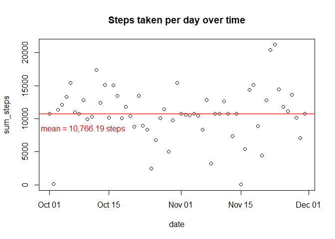
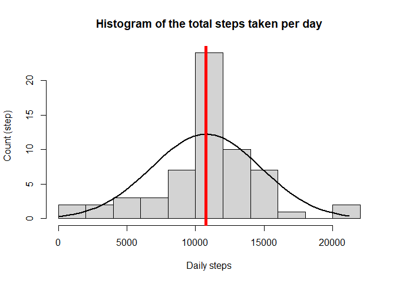
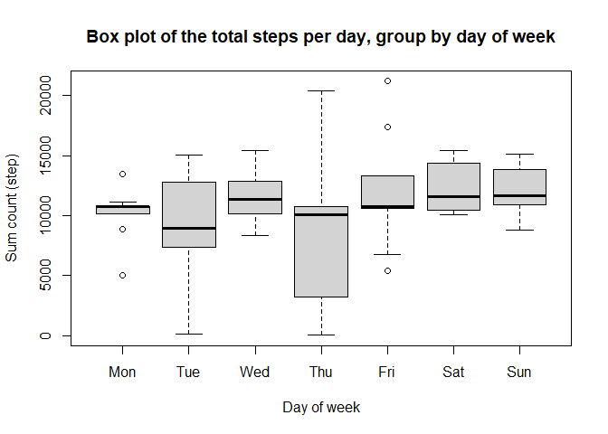
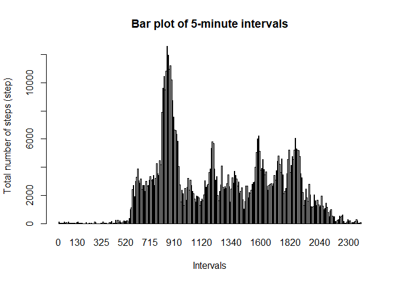

## Introduction
Activity data is now easily collected via smart watches and other athletic devices such as Fitbit and Nike Fuelband.
The goal for this project is to do data exploration to uncover the characteristics of the activity data, specifically steps taken per day and intervals. In this report, the characteristics of data is discussed.


## Loading packages

```r
library(ggplot2)
library(dplyr)  # for data manipulation grammar e.g. %>%
library(lubridate)  # working with dates
library(tidyr)  # to tidy data
```


## Loading and preprocessing the data
The activity data received is a zipped csv file. To read this data, we first unzip the file using unz command. 
This can be embedded into single line as shown below. Here, we can see that the data can be grouped by dates which contains several intervals and corresponding step counts. 

```r
# import data 
data <- read.csv(unz("activity.zip", "activity.csv"), header=TRUE, quote="\"", sep=",")
# convert date columns to date type
data$date <- as.Date(data$date, "%Y-%m-%d")
# Preview data
head(data)
```

```
##   steps       date interval
## 1    NA 2012-10-01        0
## 2    NA 2012-10-01        5
## 3    NA 2012-10-01       10
## 4    NA 2012-10-01       15
## 5    NA 2012-10-01       20
## 6    NA 2012-10-01       25
```

As we can see above, there are missing values in the data. Let's first see how many missing values we have here.


```r
sum(is.na(data))
```

```
## [1] 2304
```

To fill the missing values, I use the mean of the same five-minute interval on other days.


```r
stepintervals <- data %>% group_by(interval) %>% summarize(mean_steps = mean(steps, na.rm = TRUE))
for(i in 1:nrow(data)) {
        if(is.na(data$steps[i])) {
               avg <- which(data$interval[i] == stepintervals$interval)
               # replace the NA value with the average:
               data$steps[i] <- stepintervals[avg,]$mean_steps 
        }
}
```

We can then summarize the steps taken per day using the data manipulation grammar (e.g. "%>%"). 


```r
# Summarize data by date
sum_by_date <- data %>% 
                group_by(date) %>% 
                summarize(sum_steps = sum(steps))
str_mean <- sprintf("mean = %s steps", 
                    formatC(mean(sum_by_date$sum_steps), format="f", big.mark=",", digits=2))

# Plot daily steps over time
plot(sum_steps ~ date, sum_by_date, 
     main = "Steps taken per day over time")
abline(h = mean(sum_by_date$sum_steps), col="red")
text(x=min(sum_by_date$date)+8,y=8500,
     labels=str_mean, 
     col="red")
```

<!-- -->

Above, the scatter plot over time shows that there are not obvious patterns in the time series. On average, the number of steps taken per day is **10,766.19** steps.
Whereas, the median is **10,766.19** steps. 
Looking at the histogram below, we can see that the distribution tends to aggregate at the mean and taper off. 


```r
# plot histogram for total steps per day
h <- hist(sum_by_date$sum_steps, breaks = 15, xlab = "Daily steps", ylab = "Count (step)", 
     main = "Histogram of the total steps taken per day")


g <- sum_by_date$sum_steps
xfit <- seq(min(g), max(g), length = 40) 
yfit <- dnorm(xfit, mean = mean(g), sd = sd(g)) 
yfit <- yfit * diff(h$mids[1:2]) * length(g) 

lines(xfit, yfit, col = "black", lwd = 2)
abline(v = mean(sum_by_date$sum_steps),lwd=5, col="red")
```

<!-- -->

Another interesting thing to look at is whether the day of week makes any difference to the number of steps taken on average. 
However, we can see here that there is no consistent and significant difference between the number of steps walked based on day of week.
In other word, there are no differences between activities during weekdays and weekends.


```r
# Summarize data by day of week (DOW)
sum_by_dow <- data %>% 
                group_by(date) %>% 
                summarize(sum_steps = sum(steps))
sum_by_dow$dow = format(sum_by_dow$date, format = "%a")
sum_by_dow$dow <- factor(sum_by_dow$dow, levels = c("Mon", "Tue", "Wed", "Thu", "Fri", "Sat", "Sun"))

# plot histogram for total steps per day
boxplot(sum_steps~dow, sum_by_dow, xlab = "Day of week", ylab = "Sum count (step)", 
     main = "Box plot of the total steps per day, group by day of week")
```

<!-- -->


```r
# Summarize data by date
sum_by_interval <- data %>% 
                group_by(interval) %>% 
                summarize(sum_steps = sum(steps))

# plot histogram for total steps per day
barplot(sum_steps~interval, sum_by_interval, 
        xlab = "Intervals", ylab = "Total number of steps (step)", 
        main = "Bar plot of 5-minute intervals")
```

<!-- -->

The bar plot above showing the peak interval being **835.00** interval.


